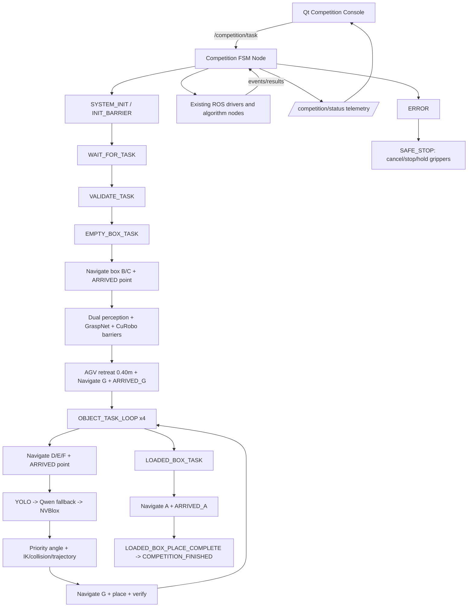

# 比赛 FSM 架构

`competition_fsm` 是纯 Python 的流程核心，`competition_fsm_node.py` 只负责 ROS 事件、Action/Topic/Service 适配和状态发布。Qt 只发布任务与控制命令，不直接调用机械臂、升降机、底盘、夹爪或算法节点。

## 流程状态

顶层状态为 `SYSTEM_INIT -> WAIT_FOR_TASK -> VALIDATE_TASK -> EMPTY_BOX_TASK -> OBJECT_TASK_LOOP -> LOADED_BOX_TASK -> FINISHED`，异常只进入 `ERROR -> SAFE_STOP`。箱体和商品的动作拆成独立状态，所有长动作通过 ROS Action 或结果 Topic 推进；mock 模式用确定性的 `ACTION_COMPLETE` 事件推进相同状态列表。

箱体阶段严格执行：箱体点 `B/C` 导航、到达帧匹配、升降、左右相机感知、左右 GraspNet、左右 CuRobo、双臂预抓取/接近/闭合 barrier、保持、AGV 后退 0.40 m、导航 `G`、50 mm 释放。商品阶段每个商品先去其 `D/E/F` 点，再执行升降、YOLO/Qwen、GraspNet、CuRobo、抓取确认、导航 `G`、300/200/50 mm 放置。最后满载箱去 `A`，不会把最终点误用成 `G`。

## Barrier 与资源

- 初始化 barrier 必须覆盖 Navigation、Lift、双臂、双夹爪、左右相机、YOLO、Qwen、GraspNet、CuRobo、NVBlox、TF 与 Qt bridge。
- `TARGET_READY` 和 `COLLISION_WORLD_READY` 同时满足后才允许 CuRobo 规划。
- 升降时机械臂必须安全；底盘运动时不允许机械臂处于伸展态；箱体双臂抓取必须左右结果同时 ready。
- `ResourceManager` 管理 `BASE/LIFT/LEFT_ARM/RIGHT_ARM/LEFT_GRIPPER/RIGHT_GRIPPER/LEFT_CAMERA/RIGHT_CAMERA/GPU_*`；GPU 优先级为运动规划、抓取推理、Qwen fallback。
- 停止、急停、TF 丢失、关键跟踪失败和驱动故障进入 `SAFE_STOP`，取消导航、停止底盘/升降/机械臂，保持夹爪，不自动打开。
